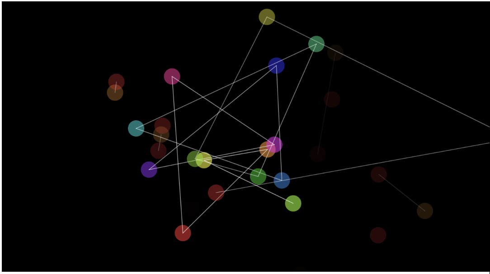

# qcai0194_9103_tut3

This is my Week8 quiz

# The First Question

In this instance, the growth trajectory, size, length, and pattern of the seagrass are determined by the creator's control of movement and trajectory. I take user input into account for this task, leveraging a technique that enhances dynamic responsiveness and flexibility. The base graphics can be predefined, while the overall canvas content is shaped by the user's movements. By enhancing human-computer interaction, the user's sense of control makes them feel actively involved in the creative process, which not only increases engagement but also makes the experience more personalized.

# The Second Question

In this code, the desired effect is achieved by generating particles, which are based on the user's mouse clicks and movement trajectory. The position and velocity of each particle are determined by the current and previous positions of the mouse. Additionally, a loopfor loop is used to connect the distances between particles, thus generating new paths.

[technology link](https://p5js.org/examples/classes-and-objects-connected-particles/)
